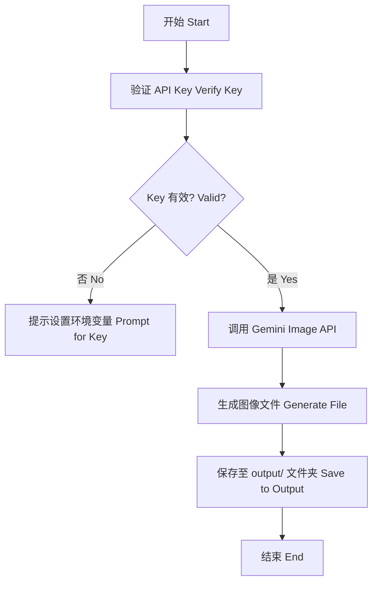

# 🍌 纳米香蕉艺术模块 (Nano Banana Art Module)
# Nano Banana Art Module

这是秋芝项目旗下的创意技能，专门利用頂尖 AI 图像引擎进行艺术创作。
A creative skill of the Qiuzhi Project, specializing in art creation using top-tier AI image engines.

---

## 🛠️ 核心功能 (Core Features)

- **艺术创作**：深度接入 Google Gemini 图像引擎。
- **独家主题**：专门生成融合纳米科技与热带风情的香蕉艺术图。
- **成果管理**：创作完成后的图片自动存入 `output/` 文件夹。

---

## 📊 逻辑展示 (Logic Visualization)



---

## 🚀 如何运行 (How to Run)

在 `qiuzhi-project` 根目录下运行：
```bash
python3 quizhi-creative/start_here.py
```
选择 **4. 🚀 进阶功能** -> **nano_banana** -> **2. 🧪 逻辑模拟器**。
