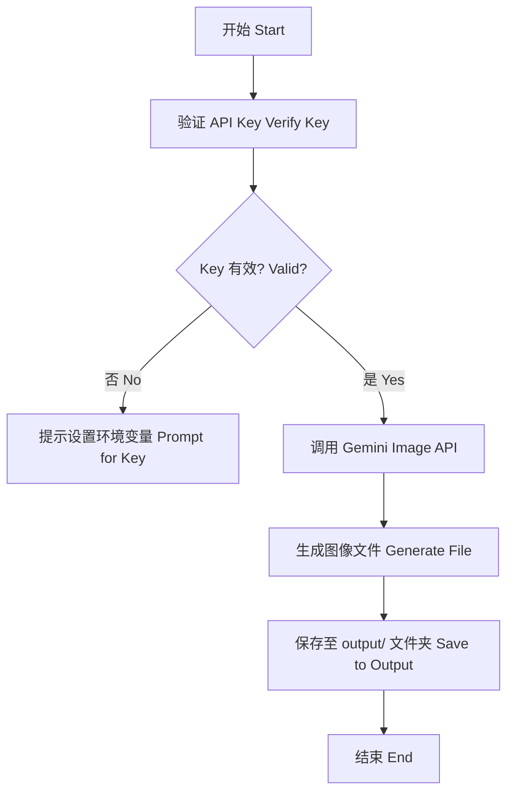

# 🍌 纳米香蕉技能 (Nano Banana Skill) - 二宝
# Nano Banana Art Skill

这是秋芝项目的“二宝”，负责利用顶尖 AI 图像引擎进行艺术创作。
The "Second Baby" of the Qiuzhi Project, responsible for creating art using cutting-edge AI image engines.

---

## 🛠️ 核心功能 (Core Features)

- **艺术创作**：接入 Google Gemini 图像引擎。
- **主题生成**：专门生成融合纳米科技与热带风情的香蕉艺术图。
- **自动保存**：创作完成后的图片会自动保存在 `output/` 文件夹中。

---

## 📊 逻辑展示 (Logic Visualization)



---

## 🚀 如何运行 (How to Run)

在 `qiuzhi-project` 根目录下运行：
```bash
python3 quizhi-creative/start_here.py
```
选择 **4. 🚀 进阶功能** -> **nano_banana** -> **2. 🧪 逻辑模拟器**。
