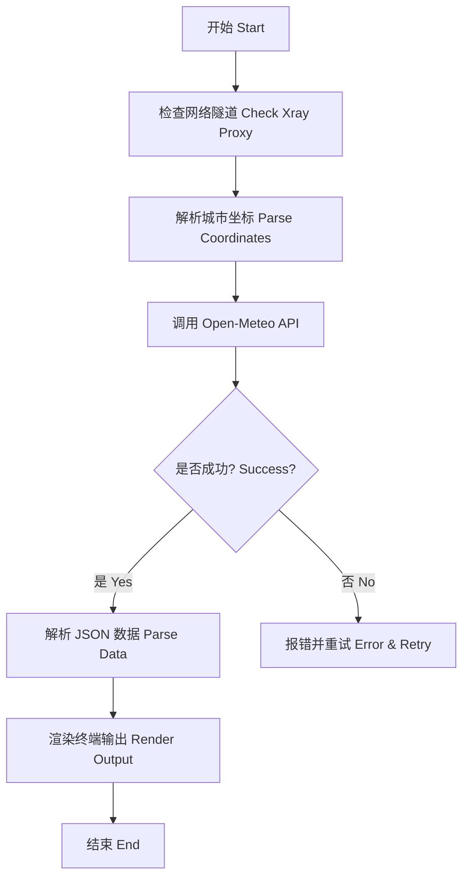

# 🌤️ 天气技能 (Weather Skill) - 大宝
# Weather Skill

这是秋芝项目的“大宝”，负责为用户提供实时的全球天气查询服务。
The "Big Baby" of the Qiuzhi Project, responsible for providing real-time global weather query services.

---

## 🛠️ 核心功能 (Core Features)

- **实时查询**：连接 Open-Meteo API 获取精准天气数据。
- **全球支持**：支持北京、上海、洛杉矶、悉尼等多个主要城市。
- **极客展示**：通过 Xray 隧道抓取数据，以硬核 ASCII Art 形式展现。

---

## 📊 逻辑展示 (Logic Visualization)



---

## 🚀 如何运行 (How to Run)

在 `qiuzhi-project` 根目录下运行：
```bash
python3 quizhi-creative/start_here.py
```
选择 **4. 🚀 进阶功能** -> **weather** -> **2. 🧪 逻辑模拟器**。
