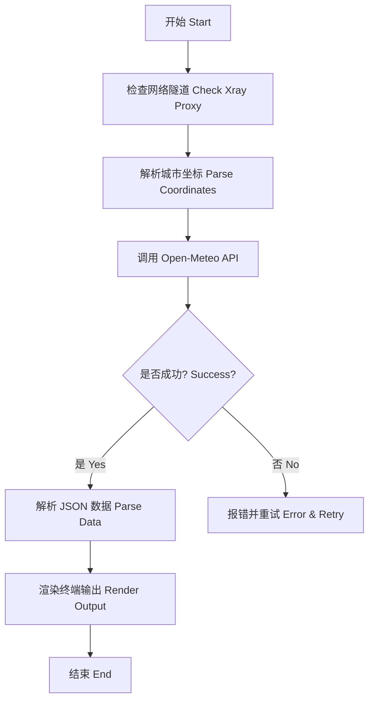

# 🌤️ 天气技能模块 (Weather Skill Module)
# Weather Skill Module

这是秋芝项目旗下的核心技能之一，负责为用户提供实时的全球天气查询服务。
One of the core skills of the Qiuzhi Project, providing real-time global weather query services.

---

## 🛠️ 核心功能 (Core Features)

- **实时查询**：连接 Open-Meteo API 获取精准天气数据。
- **全球支持**：内置多座国际都市坐标，支持全球范围搜索。
- **硬核展示**：结合 Xray 隧道与 ASCII Art，提供极客风交互体验。

---

## 📊 逻辑展示 (Logic Visualization)



---

## 🚀 如何运行 (How to Run)

在 `qiuzhi-project` 根目录下运行：
```bash
python3 quizhi-creative/start_here.py
```
选择 **4. 🚀 进阶功能** -> **weather** -> **2. 🧪 逻辑模拟器**。
